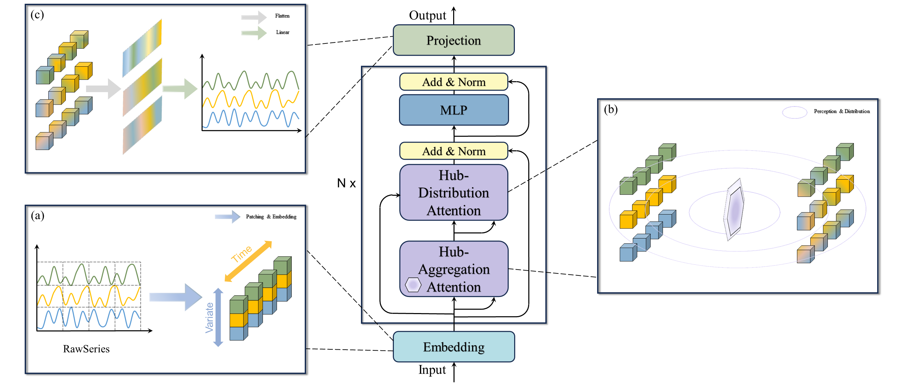

# AHuber: Learning a Global Hub for Multivariate Time Series Forecasting via Echoic Perception

[](LICENSE)
[](https://www.python.org/)
[](https://pytorch.org/)

**AHuber** is a novel deep learning framework that introduces the paradigm of **Echoic Perception** for multivariate time series forecasting. It breaks the quadratic computational bottleneck of existing interaction-aware models, achieving **Linear Complexity $\mathcal{O}(N \cdot L)$** while capturing robust global dependencies.

> **Core Philosophy:** Robust system modeling does not require tracking every pairwise interaction $\mathcal{O}(N^2)$, but rather **distilling** the core dynamics into a compact Global State and **distributing** it back to local contexts.

## 🚀 The Dilemma & Our Solution

In Multivariate Time Series Forecasting (MTSF), existing models face a fundamental dilemma:
*   **Channel-Independent Models (e.g., PatchTST):** $\mathcal{O}(L^2)$ and ignore cross-variable interactions.
*   **Channel-Mixing Models (e.g., iTransformer):** Capture interactions but suffer from **$\mathcal{O}(N^2)$ complexity** and overfitting risks on high-dimensional data.

**AHuber solves this by introducing a "Hub" mechanism:**
Instead of all-to-all attention, AHuber uses a small set of learnable **Proxy Tokens** to act as agents. They **perceive** the holistic system state (Distill) and then **echo** this information back to local patches (Distribute).

## ✨ Key Features

*   **📉 Linear Complexity:** Achieves $\mathcal{O}(N \cdot L)$ complexity. Memory usage grows linearly, avoiding OOM errors on high-dimensional datasets (e.g., Traffic with 862 sensors) where iTransformer fails.
*   **🔄 Echoic Perception:** A novel two-stage attention mechanism:
    1.  **Hub-Aggregation (MPA):** Proxies actively distill high-dimensional inputs into a compact Global State.
    2.  **Active Retrieval:** Local patches selectively retrieve relevant global contexts (e.g., trends, periodicities) via a Sigmoid-gated mechanism.
*   **🏗️ EchoLayer Backbone:** Stacked layers that hierarchically refine the system state, evolving from chaotic initial perceptions to structured, physically meaningful manifolds.
*   **⚡ High Efficiency:** Significantly faster training throughput and lower inference latency compared to SOTA baselines.

## 🧠 Model Architecture

The core of AHuber is the **EchoLayer**, which operationalizes the "Distill-and-Distribute" paradigm:

1.  **Input:** Multivariate series are patched and embedded with **2D Positional Encodings** (Time + Variable coordinates).
2.  **Perception (Stage 1):** **Multi-head Proxy Attention (MPA)** uses learnable proxies to compress the input canvas into a low-rank Global Context.
3.  **Distribution (Stage 2):** An **Active Retrieval** module allows local tokens to query the Global Context, refining their representations with system-wide insights.



## 📊 Performance & Efficiency

AHuber achieves state-of-the-art performance on 8 benchmarks, demonstrating superior accuracy on datasets like **Electricity** and competitive results on **Traffic**, while maintaining significantly lower computational costs.
### Accuracy (MSE)
| Model | Traffic ($N=862$) | Electricity ($N=321$) | Weather ($N=21$) |
| :--- | :---: | :---: | :---: |
| **AHuber** | 0.405 | **0.137** | **0.157** |
| iTransformer | **0.395** | 0.148 | 0.174 |
| PatchTST | 0.462 | 0.174 | 0.177 |

### Efficiency (at $N=862$)
*   **Training Memory:** AHuber consumes **~2.8GB** vs. iTransformer's **>3.3GB** (Quadratic explosion).
*   **Inference Latency:** AHuber is **28% faster** than iTransformer and **55% faster** than PatchTST.

## 📦 Installation

1.  Clone the repository:
    ```bash
    git clone https://github.com/night-ice-ball/AHuber.git
    cd AHuber
    ```

2.  Install requirements:
    ```bash
    pip install -r requirements.txt
    ```

## ⚡ Usage

You can reproduce our experiments using the `gogogo.py` script.

**Example: Training on Traffic Dataset**
```bash
python gogogo.py \
  --is_training 1 \
  --root_path ./data/traffic/ \
  --data_path traffic.csv \
  --model_id traffic_96_96 \
  --model AHuber \
  --data traffic \
  --features M \
  --seq_len 96 \
  --pred_len 96 \
  --e_layers 3 \
  --n_heads 8 \
  --d_model 128 \
  --d_ff 512 \
  --batch_size 32
```

## 📂 Directory Structure

```
AHuber/
├── data_provider/      # Data loading and processing
├── exp/                # Experiment logic (train/test/val)
├── layers/             # Core model layers (AHuber_backbone.py, RevIN.py)
├── models/             # Model wrappers
├── utils/              # Utility functions (metrics, tools)
├── gogogo.py           # Main entry point
└── requirements.txt    # Dependencies
```

## 📜 License

This project is licensed under the MIT License - see the LICENSE file for details.

## 🙏 Acknowledgement

We appreciate the following GitHub repos for their valuable code base:
*   [PatchTST](https://github.com/yuqinie98/PatchTST)
*   [iTransformer](https://github.com/thuml/iTransformer)

---
