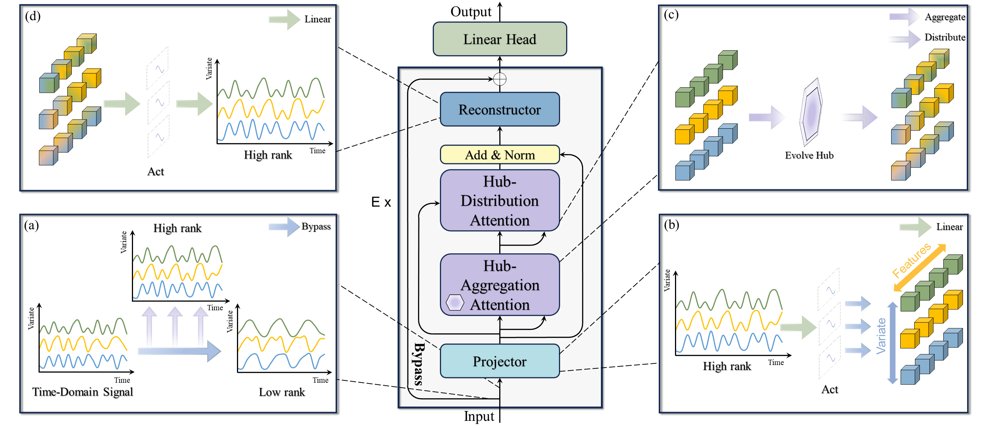

# AHuber: Learning a Global Hub for Multivariate Time Series Forecasting

[](LICENSE)
[](https://www.python.org/)
[](https://pytorch.org/)

**AHuber** is a Transformer architecture built on the principle of **Rank-Decoupled Iterative Refinement** for **multivariate time series forecasting**. It breaks the quadratic computational bottleneck of dense cross-variate attention, achieving **strict linear complexity $\mathcal{O}(N)$** while outperforming existing efficient models.

**Core Philosophy:** Real-world multivariate data contains both stable structural patterns (Low-Rank) and complex fine-grained interactions (High-Rank). Forcing all this into a single static bottleneck causes severe information blurring. Instead, AHuber explicitly decouples the learning pathways: an **Explicit Bypass** nativesly preserves the structural low-rank skeletons, while a context-aware **Evolving Hub** actively distills and injects high-rank temporal details.

## 🚀 The Dilemma & Our Solution

In Multivariate Time Series Forecasting (MTSF), existing paradigms face a fundamental dilemma:
*   **Quadratic Redundancy :** Standard channel-mixing Transformers capture cross-variate correlations effectively but incur massive, prohibitive computational overhead, often overfitting on sparse real-world dependencies.
*   **Statistical Fragility (The Bottleneck Dilemma):** Recent efficient models (e.g., simple pooling or static bottlenecks) rely on rigid statistical compression (like weighted averaging). This passive, non-adaptive aggregation forces stable intrinsic structures to entangle with nuanced sequence variations, resulting in irreversible **information blurring**.

**AHuber solves this via Active Rank-Decoupled Refinement:**
Instead of relying on heuristic statistical pooling or rigid temporal decomposition, AHuber utilizes an attention-driven, single centralized **Evolving Hub** paired with an **Explicit Bypass**. It routes information dynamically, ensuring precise detail recovery without arbitrary statistical priors.

## ✨ Key Features

*   **📉 Strict Linear Complexity:** Drops the interaction complexity to $\mathcal{O}(N \cdot D)$. Operates flawlessly on massive-variate datasets (e.g., Traffic with 862 sensors) where dense Transformers hit Out-of-Memory (OOM) errors.
*   **✂️ Rank-Decoupled Dual-Pathways:** 
    1.  **Structural Preservation (Explicit Bypass):** Acts as a lossless highway for persistent, low-rank global trends.
    2.  **Contextual Refinement (Evolving Hub):** An attention-driven latent bottleneck that actively computes dynamic similarity scores to distill missing high-rank cross-variate interactions layer by layer.
*   **🧠 Prior-Agnostic & Memory-Evolving:** No rigid assumptions (e.g., periodic decomposition). The Hub maintains a persistent memory that evolves hierarchically across deep layers, learning a coherent system-wide state.
*   **⚡ Massive Efficiency Gains:** Delivers an **$11\times$ reduction** in peak memory and up to **7.5$\times$ training speedup** compared to SOTA dense Transformers.

## 🧠 Model Architecture

The AHuber framework synchronizes two core components across its network depth:

1. **Active Aggregation & Contextual Distribution:** The single Evolving Hub token queries all variates to actively build a global context, then variates individually query the Hub to retrieve tailored refinement patterns. No dense $N \times N$ matrix multiplications are ever performed.
2. **Iterative Time-Domain Repair:** A lightweight temporal reconstructor maps the latent updates back to the sequence dimension, injecting complex interactions specifically where the unhindered Explicit Bypass falls short.

 
## 📊 Performance & Efficiency

AHuber establishes new state-of-the-art accuracy across major benchmarks while showcasing an optimal efficiency-performance trade-off.

### Accuracy (Avg. MSE)
| Model | Traffic ($N=862$, $L \in \{336..720\}$) | Electricity ($N=321$) | Weather ($N=21$) | Solar ($N=137$) |
| :--- | :---: | :---: | :---: | :---: |
| **AHuber (Ours)** | **0.385** | **0.157** | **0.225** | **0.198** |
| PatchTST | 0.403 | 0.159 | **0.225** | 0.200 |
| iTransformer | **0.362** | 0.164 | 0.232 | 0.199 |
| SOFTS | 0.381 | 0.164 | 0.234 | 0.208 |

### Efficiency (Evaluated on Traffic dataset, $N=862$)
*   **Peak Memory Footprint:** AHuber consumes **~0.1 GB**, while iTransformer requires **>1.1 GB** (An $11\times$ massive reduction).
*   **Training Throughput:** Up to **7.5$\times$ faster processing time per batch** against dense self-attention architectures.

## 📦 Installation

1.  Clone the repository:
    ```bash
    git clone https://github.com/night-ice-ball/AHuber.git
    cd AHuber
    ```

2.  Install requirements:
    ```bash
    pip install -r requirements.txt
    ```

## ⚡ Usage

To reproduce our experiments (e.g., on the Electricity dataset), run the provided script:

```bash
scripts/electricity.sh
```

## 📜 License

This project is licensed under the MIT License - see the LICENSE file for details.

