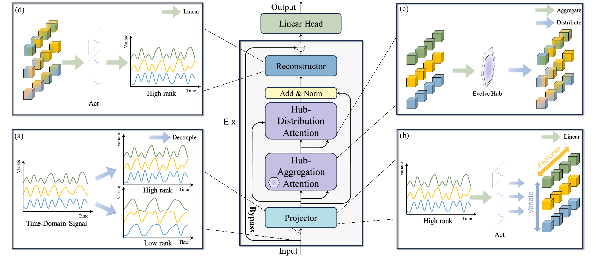

# AHuber: Learning a Global Hub for Multivariate Time Series Forecasting

[](LICENSE)
[](https://www.python.org/)
[](https://pytorch.org/)

**AHuber** is a Transformer Based framework that introduces the paradigm of **Centralized Information** for multivariate time series forecasting. It breaks the quadratic computational bottleneck of existing interaction-aware models, achieving **Linear Complexity $\mathcal{O}(N \cdot L)$** while capturing robust global dependencies.

> **Core Philosophy:** Robust system modeling does not require tracking every pairwise interaction ($\mathcal{O}(N^2)$). Instead, AHuber **distills** core dynamics into a compact Global Hub and **distributes** refined context back to local variables, effectively decoupling the **System State** from **Local Details**.

## 🚀 The Dilemma & Our Solution

In Multivariate Time Series Forecasting (MTSF), existing models face a fundamental dilemma:
*   **Quadratic Redundancy:** Vanilla Transformer models capture correlations effectively but suffer from massive computational overhead and overfitting risks on sparse dependencies.
*   **Simplified Efficiency:** Previous efficient architectures often rely on simple statistical aggregation or linear decomposition. While fast, this limits their capacity to explicitly model deep, evolving system dynamics and long-range dependencies across variables.


**AHuber solves this by introducing an Attention-based "Dual-Pathway Mechanism":**


AHuber avoids all-to-all attention by using a learnable **Global Hub** vector. It employs a "State-Detail Decoupling" strategy:
1.  **Latent Pathway:** Tracks the macroscopic system state via the Hub.
2.  **Physical Pathway:** Preserves microscopic fluctuations via explicit residuals.

## ✨ Key Features

*   **📉 Linear Complexity:** Achieves $\mathcal{O}(N \cdot L)$ complexity. Memory usage grows linearly, avoiding OOM errors on high-dimensional datasets where Vanilla Transformer fails.
*   **🔄 Dual-Pathway Mechanism:** A "State" and "Detail“ decoupling mechanism:
    1.  **Latent Pathway:** Captures evolving global dependencies via a centralized attentive bottleneck.
    2.  **Physical Pathway:** Bypasses the bottleneck to explicitly reconstruct high-frequency details in the time domain.
*   **🧠 Evolving Memory:** AHuber acts as a continuous state tracker. The Hub state evolves hierarchically, maintaining a coherent existence of system dynamics.
*   **⚡ High Efficiency:** Significantly faster training throughput and lower inference latency compared to Transformer-based SOTA baselines.

## 🧠 Model Architecture

The AHuber framework consists of two synergistic components:

### 1. Evolving Hub Memory (Latent Pathway)
    Active Aggregation Distribution: The Hub acts as an active observer to **aggregate** information from all variates and **distribute** refined global context back, functioning as a synchronization center.
    Memory Evolution: The Hub maintains a persistent memory that evolves deeper into the network, shifting focus from initial chaos to structured manifolds.

### 2. Explicit Detail Capture (Physical Pathway)

*   **Temporal Reconstructor:** A lightweight decoder maps latent features back to the time domain, aiming to **preserve high-frequency temporal details** capable of bypassing the Hub compression.
*   **Physical-Space Residual:** This works in tandem with the Hub by diverting fine-grained noise and local fluctuations to the residual branch. This allows the Hub to focus solely on dominant trends, while the residual path handles the details:

 

## 📊 Performance & Efficiency

AHuber achieves state-of-the-art performance on 9 benchmarks, demonstrating superior accuracy while maintaining significantly lower computational costs.
### Accuracy (MSE)
| Model | Traffic ($N=862$) | Electricity ($N=321$) | Weather ($N=21$) |
| :--- | :---: | :---: | :---: |
| **AHuber** | **0.386** | **0.159** | **0.228** |
| iTransformer | 0.397 | 0.163 | 0.232 |
| PatchTST | 0.391 | **0.159** | 0.241 |

### Efficiency (at $N=862$)
*   **Memory Footprint:** AHuber consumes **~0.1GB** vs. iTransformer's **>1.1GB** (Quadratic explosion).
*   **Training Speed:** AHuber is up to **7.5$\times$ faster** than quadratic attention baselines.
*   **Scalability:** AHuber scales linearly with the number of variates.

## 📦 Installation

1.  Clone the repository:
    ```bash
    git clone https://github.com/night-ice-ball/AHuber.git
    cd AHuber
    ```

2.  Install requirements:
    ```bash
    pip install -r requirements.txt
    ```

## ⚡ Usage

You can reproduce our experiments (e.g., on the Traffic dataset), run the provided script:

    ```bash
    bash scripts/traffic.sh
    ```

## 📜 License

This project is licensed under the MIT License - see the LICENSE file for details.

## 🙏 Acknowledgement

We appreciate the following GitHub repos for their valuable code base:
*   [PatchTST](https://github.com/yuqinie98/PatchTST)
*   [iTransformer](https://github.com/thuml/iTransformer)
*   [SOFTS](https://github.com/Secilia-Cxy/SOFTS)
---
